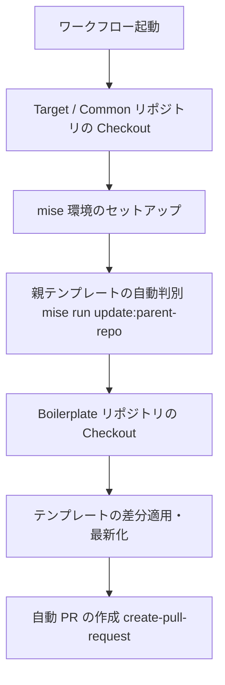

# 📖 テンプレート自動同期（自動更新）仕様書

## 1. 概要
本ワークフローは、親テンプレート（`Boilerplate` 等）や共通設定（`Common`）の変更を検知・同期し、対象リポジトリに対して自動で更新用の Pull Request (PR) を作成するシステムである。

---

## 2. システム構成ファイル一覧
| ファイルパス | 役割・概要 |
| :--- | :--- |
| `.github/workflows/update-templates-reusable.yml` | 自動同期の全体制御・ジョブ定義を行う再利用可能ワークフロー。 |
| `.github/actions/core/checkout-repos` | ターゲット、Boilerplate、Common の各リポジトリを必要に応じて順次チェックアウトする複合アクション。 |
| `.github/actions/wrap/checkout` | `actions/checkout` の実行パラメータ整理および共通化を行うラッパー。 |
| `.github/actions/wrap/create-pull-request` | `peter-evans/create-pull-request` を使用し、変更差分を PR 化するラッパー。 |
| `.github/actions/wrap/mise` | `jdx/mise-action` を呼び出して `mise` 実行環境のセットアップおよびキャッシュ管理を行うラッパー。 |
| `.config/mise/tasks/update/parent-repo` | 引数（`AUTO` 等）を受け取り、同期元となる親テンプレートリポジトリ名を判別・出力するスクリプト。 |
| `docs/spec/template-auto-sync.md` | システムのアーキテクチャ、構成ファイル、設定要件、および障害対応を記録した仕様書。 |

---

## 3. 全体フロー



1. **環境準備:** 対象リポジトリおよび共通リポジトリのチェックアウトと、`mise` によるツール環境の復元を行う。
2. **親リポジトリ判別:** `mise run update:parent-repo` タスクを実行し、同期元となるテンプレートリポジトリ（`mon2org/Boilerplate` 等）を判別する。
3. **差分同期:** 判別された親テンプレートの最新情報を取得し、差分を適用・最新化する。
4. **PR 作成:** 変更差分が存在する場合、指定ブランチ（例: `chore/sync-templates`）を作成し、自動で Pull Request を発行する。

---

## 4. 前提条件・事前設定

本ワークフローを正常に動作させるため、GitHub リポジトリ側で以下の設定があらかじめ完了している必要がある。

### 4.1 GITHUB_TOKEN 権限の設定 (Workflow 内)
ワークフローファイル側で以下の権限を付与する。
* `contents: write`
* `pull-requests: write`

### 4.2 リポジトリ設定 (GitHub Web 画面)
GitHub Actions による自動 PR 作成を許可する必要がある。

* **設定場所:** `Settings` ＞ `Actions` ＞ `General` ＞ **`Workflow permissions`**
* **有効化項目:** `Allow GitHub Actions to create and approve pull requests` にチェックを入れる。

---

## 5. `mise` タスクの構成ルール

タスクファイル（例: `.config/mise/tasks/update/parent-repo`）を作成・編集する際は、以下のルールを遵守する。

* **ファイルベースタスクのヘッダー:**
  * ファイル本文自体が実行スクリプトとなるため、ヘッダー（TOML/YAML形式のコメント部）に `run = ...` フィールドを記述してはならない。
  * `description` や `alias` などのメタデータのみを記述する。
* **実行権限 (`chmod +x`):**
  * Git リポジトリ上で対象ファイルに実行権限を付与しておく必要がある。
  ```bash
  chmod +x .config/mise/tasks/update/parent-repo
  ```

---

## 6. トラブルシューティング

| エラーメッセージ / 現象 | 原因 | 処置 |
| :--- | :--- | :--- |
| `unknown field(s) ["run"] in task file header` | `mise` タスクのヘッダーに不要な `run` フィールドが存在する。 | ヘッダーから `run` 記述を削除し、ファイル本文に直接スクリプトを記述する。 |
| `no task ... found, but a non-executable file exists` | タスクファイルに実行権限が付与されていない。 | ローカルで `chmod +x <file>` を実行し、Git に Commit/Push する。 |
| `GitHub Actions is not permitted to create or approve pull requests.` | リポジトリの Actions 設定で PR 作成が許可されていない。 | リポジトリ設定の `Workflow permissions` で PR 作成を許可する。 |